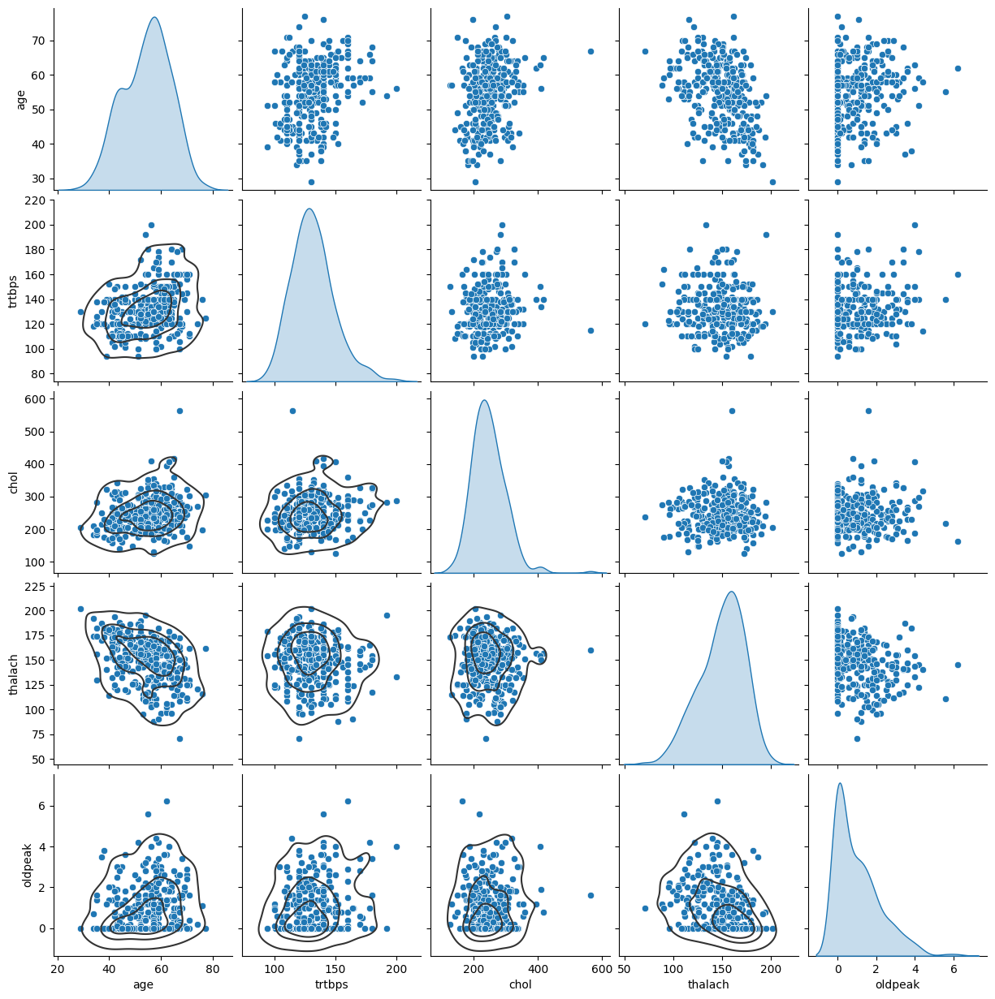

<br/>
<p align="center">
  <h2 align="center">Heart attack prediction analysis  using machine learning</h2>

</p>

    

## Table Of Contents

* [About the Project](#about-the-project)
* [Built With](#built-with)
* [Getting Started](#getting-started)
  * [Prerequisites](#prerequisites)
  * [Installation](#installation)
* [Authors](#authors)
* [Acknowledgements](#acknowledgements)

## About The Project


This project mainly focused on prediction of the two classes, which is possible to heart attack or  not due to getting information on attribute variables of chest pain, resting blood pressure, Cholesterol, fasting blood sugar, resting electro cardio graphic results, maximum heart rate, exercise-induced angina( 1 = Yes,  0 = No), previous peak. This project is a Binary class classification problem.

## Built With

This  project is built using supervised machine learning algorithms, which model created by RandomForestClassifier


## Getting Started

Before starting this project you need to install several libraries.

### Prerequisites

* pandas

```sh
pip install pandad
```
* numpy

```sh
pip install numpy
```
* matplotlib

```sh
pip install matplotlib
```

## Authors

* **Shashika Udata** - *Undergraduate in Sabaragamuwa University of Sri Lanka* - [Shashika Udata](https://github.com/Code9633/) - *Built ReadME Template*

